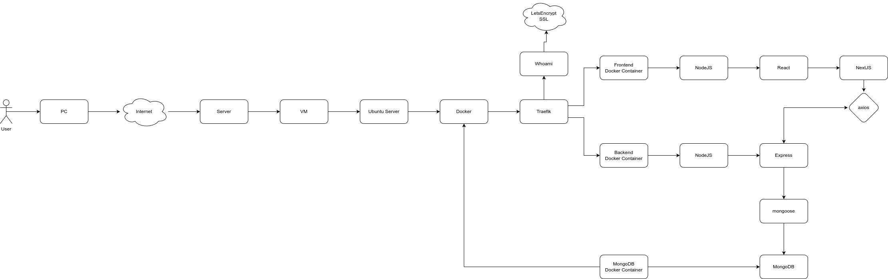

# htlw-workshop-S24
This repository contains the the resources for the S24 workshop at the HTL-Wels

## Agenda

1. Introduction
2. Workshop Goal
3. Technologies Involved
    - From Bare-Metal to Frontend Libraries
    - Server
    - Ubuntu Server Running in VMs
    - VMs have Public IPs
    - Domains have A entries to these VMs Public IPs
    - Docker
    - Docker Images
    - Traefik
    - ...
4. Project Setup (VSCode + Plugins + npm install)
    - Error Lens
    - DotEnv
    - Prettier
    - Pretty TypeScript errors
    - ESLint
5. Typescript
6. Backend
    - introductions
    - project setup
        - npm init
        - install packages
        - create folders
        - download files 

